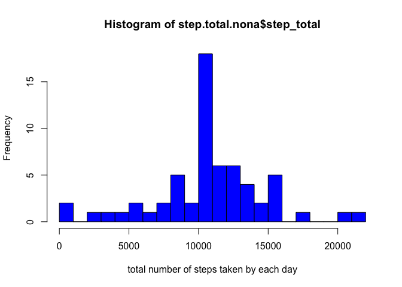

# Reproducible Research: Peer Assessment 1
## Loading library
These are the packages used in this assessment. 

```r
library(httr)
library(stringr)
library(dplyr)
```

```
## 
## Attaching package: 'dplyr'
## 
## The following object is masked from 'package:stats':
## 
##     filter
## 
## The following objects are masked from 'package:base':
## 
##     intersect, setdiff, setequal, union
```

```r
library(lattice)
```
## Loading and preprocessing the data
Unzip the file.

```r
unzip("activity.zip")
```
Load the data set.

```r
data <- read.csv("activity.csv")
```
Convert the "Date" variable into class "Date".

```r
data$date <- as.Date(data$date)
```

## What is mean total number of steps taken per day?
Calculate total number of steps taken per day. Here, I use "dplyr" package for grouping and calculation. 

```r
step.date <- group_by(data, date)
step.total <- summarize(step.date, 
                      step_total = sum(steps, na.rm = T))
```
Make a histogram of the total number of steps taken each day

```r
hist(step.total$step_total, breaks = 20, xlab = "total number of steps taken by each day", col = "blue")
```

 

Calculate and report the mean and median of the total number of steps taken per day

```r
summary(step.total$step_total)
```

```
##    Min. 1st Qu.  Median    Mean 3rd Qu.    Max. 
##       0    6778   10400    9354   12810   21190
```
Median: 10400  
Mean: 9354  

## What is the average daily activity pattern?
Generate a new data set with average daily activity. 

```r
step.interval <- group_by(data, interval)
step.avg <- summarise(step.interval, step_avg = mean(steps, na.rm = T))
```
Make a time series plot.

```r
par(mfrow = c(1,1))
with(step.avg, plot(interval, step_avg, type = "l", 
                   xlab = "interval", 
                   ylab = "average steps")
)
```

 

The 5-minute interval contains the maximum number of steps

```r
max <- step.avg %>% arrange(desc(step_avg))
print(max$interval[1])
```

```
## [1] 835
```

## Imputing missing values
Calculate and report the total number of missing values in the data set. 

```r
na.nu <- sum(is.na(data$steps))
print(na.nu)
```

```
## [1] 2304
```
Filling missing value with the mean of that 5 min interval.

```r
data.no.na <- data
x <- 1
for (i in data$steps){
        if (is.na(i)){
                data.no.na[x, "steps"] <- step.avg[step.avg$interval == data.no.na[x, "interval"], ]$step_avg
        }
        x <- x+1
}
```
Make a histogram of the total number of steps taken each day and calculate and report the mean and median total number of steps taken per day. 

```r
step.date.nona <- group_by(data.no.na, date)
step.total.nona <- summarize(step.date.nona, 
                        step_total = sum(steps, na.rm = T))

hist(step.total.nona$step_total, breaks = 20, xlab = "total number of steps taken by each day", col = "blue")
```

 

Re-calculate the mean and median.

```r
summary(step.total.nona$step_total)
```

```
##    Min. 1st Qu.  Median    Mean 3rd Qu.    Max. 
##      41    9819   10770   10770   12810   21190
```
Compare to the original data set.

```r
summary(step.total$step_total)
```

```
##    Min. 1st Qu.  Median    Mean 3rd Qu.    Max. 
##       0    6778   10400    9354   12810   21190
```
We found the mean and median of total steps per day changed, because I replaced the NAs by the mean value. This procedure will increase the total step counts, which increase the mean and median of the step counts. 

## Are there differences in activity patterns between weekdays and weekends?
In order to answer this question, I have to make a new variable with two factors "weekend" and "weekday". This factors are changed according to the "date" variable. 

```r
weekdays1 <- c('Monday', 'Tuesday', 'Wednesday', 'Thursday', 'Friday')
data$wDay <- factor((weekdays(data$date) %in% weekdays1), 
                   levels=c(FALSE, TRUE), labels=c('weekend', 'weekday'))
```

Make a plot separating weekend and weekday. 

```r
step.interval <- group_by(data, wDay, interval)
step.avg <- summarise(step.interval, step_avg = mean(steps, na.rm = T))
xyplot(step.avg$step_avg ~ step.avg$interval | step.avg$wDay, layout(1, 2), type = "l", 
       ylab = "Number of steps", 
       xlab = "Interval")
```

 

Are they different?
The answer should be "I don't know". The pattern looks slightly different, but I did not include error bar in the plot. Without the help of statistic analysis, we won't be able to know if there is significant difference or not. 
